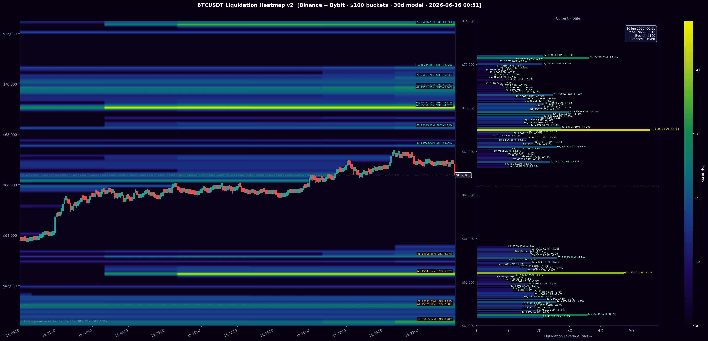
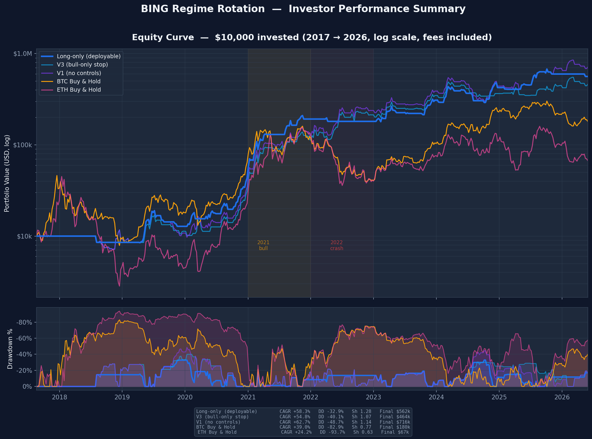
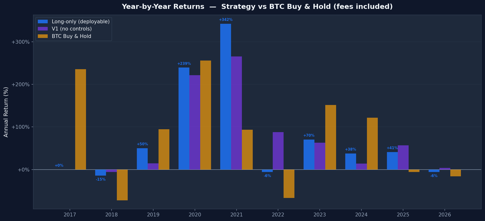
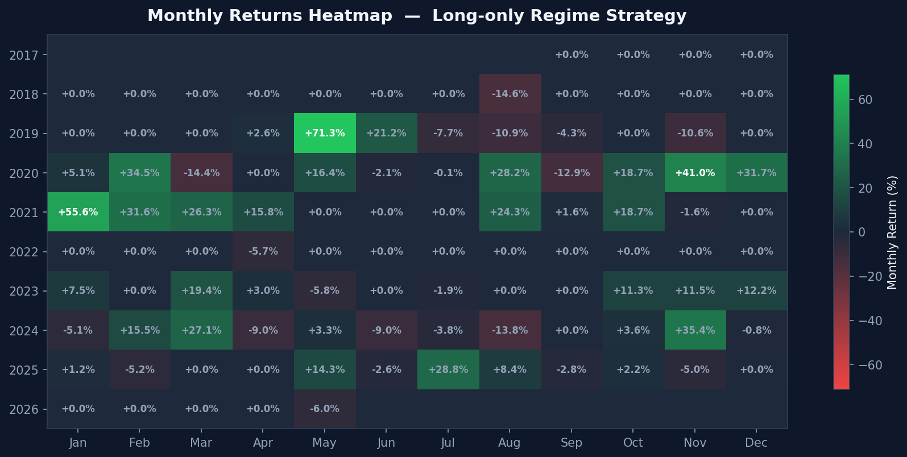
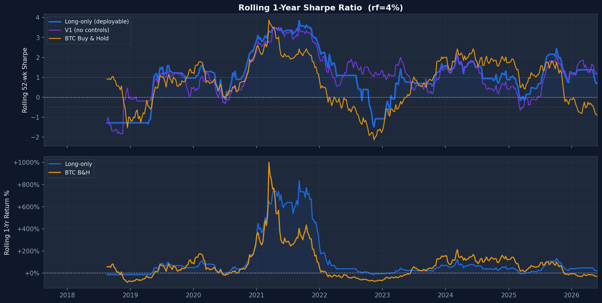
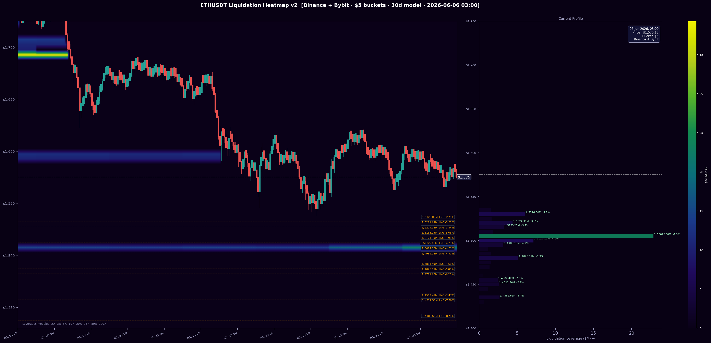
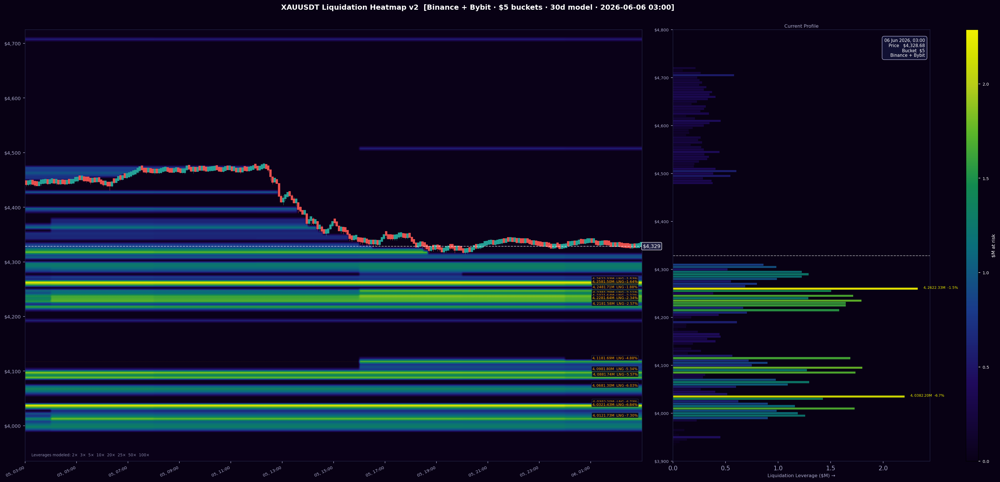

<div align="center">

# LSCO — Liquidation Scalp Cascade Oracle

**Real-time perpetual futures engine that hunts liquidation cascades on BTC, ETH, and XAUUSDT**

[](https://python.org)
[](https://asterdex.com)
[](https://aws.amazon.com/ec2/)
[]()
[](LICENSE)

</div>

---

## The Heatmap Signal

> LSCO does not trade price action. It trades **where money will be forced to move.**

Every leveraged position has a liquidation price. When millions of dollars cluster at a single price level, the market is drawn toward it like a magnet — liquidating those positions generates a cascade of forced market orders, producing a predictable micro-move that LSCO fades.

<div align="center">


*BTC/USDT liquidation heatmap — yellow/green zones are clusters of leveraged positions ripe for cascade. Price approaches a zone → LSCO enters. Price overshoots and reverses → LSCO exits.*
</div>

---

## Alpha Thesis

Perpetual futures markets have a structural inefficiency: **forced liquidations are predictable in location but not in exact timing.**

When price drifts within 0.8% of a large liquidation cluster:
1. Undercollateralised longs (or shorts) begin to get margin-called
2. Exchange liquidation engines fire market orders in the same direction
3. Price overshoots the zone by a short distance, then reverses as the cascade exhausts itself
4. **LSCO fades the overshoot** — entering after the wick, exiting 1.5× ATR in the reversal direction

This is not a momentum strategy. It is a **liquidity-driven mean-reversion scalp** timed to liquidation events.

---

## Architecture

```
┌─────────────────────────────────────────────────────────────┐
│                     LSCO Engine (async)                     │
│                                                             │
│   ┌──────────────┐  ┌──────────────┐  ┌──────────────┐    │
│   │   BTCUSDT    │  │   ETHUSDT    │  │   XAUUSDT    │    │
│   │  Engine v4   │  │  Engine v4   │  │  Engine v4   │    │
│   │  Lev: 20×    │  │  Lev: 20×    │  │  Lev: 10×    │    │
│   └──────┬───────┘  └──────┬───────┘  └──────┬───────┘    │
│          │                 │                  │             │
│   ┌──────▼─────────────────▼──────────────────▼────────┐  │
│   │              Signal Pipeline                         │  │
│   │  Liquidation Heatmap → Zone Scanner → Whale Flow    │  │
│   │  ATR Filter → Confidence Score → Entry Trigger      │  │
│   └──────────────────────────────────────────────────── ┘  │
│                                                             │
│   ┌────────────────────────────────────────────────────┐   │
│   │              Order Execution Layer                  │   │
│   │  EIP-712 Signing → SmartLimitOrder → Fill Confirm  │   │
│   │  GTC Entry → IOC Close → Position-Size Verified    │   │
│   └────────────────────────────────────────────────────┘   │
└─────────────────────────────────────────────────────────────┘
           │                                    │
    AsterDEX Futures API              Binance + Bybit
    (Perpetuals, EIP-712)           (Heatmap data source)
```

---

## Signal Pipeline

### 1. Heatmap Construction
Every 5 minutes, the engine fetches combined open-interest data from **Binance + Bybit**, models estimated liquidation prices per $100 price bucket, and renders a real-time liquidation density map per symbol.

```python
# Zones worth targeting (minimum notional)
BTCUSDT: $10,000,000  per zone
ETHUSDT:  $2,000,000  per zone
XAUUSDT:    $500,000  per zone
```

### 2. Zone Approach Detection
Each minute, price is compared against all active liquidation zones. Entry is only attempted when price enters the **approach window** (within 0.8% of zone).

### 3. Confidence Scoring

| Factor | Points |
|--------|--------|
| Base score | 50 |
| Zone size > $30M | +10 |
| Zone size > $60M | +5 |
| Cluster total > $60M | +10 |
| 3+ stacked zones | +10 |
| Whale flow aligned | +15 |
| Whale flow opposed | −20 |
| **Min to trade (BTC)** | **65** |
| **Min to trade (ETH/XAU)** | **50** |

### 4. Trigger Condition
Entry fires only when all of these are true:
- Price entered the approach window
- Last 1-minute candle **closed back inside** the zone (overshoot confirmed)  
- Hourly trend is not strongly counter-directional (regime filter)
- Zone cooldown has expired (600s after loss, 180s after win)
- Confidence score ≥ minimum threshold

### 5. Sizing & Exits
```
Risk per trade : 1% of free balance (hard cap: $2 USDT — testing phase)
T1 entry       : Base quantity at zone touch
T2 entry       : 1.6–2.2× base, placed at Q-average (only after breakeven)
Take Profit    : 1.5× ATR from entry
Stop Loss      : 0.75× ATR from entry  (2:1 R:R)
Trailing stop  : Moves SL to breakeven at 0.5× ATR profit
                 Trails at best_seen − 0.6× ATR beyond that
```

---

## Engine Versions

| Version | Key Feature | Status |
|---------|-------------|--------|
| `liq_algo.py` | v1 — baseline single-asset | Legacy |
| `liq_algo_v2.py` | v2 — IOC closes, trailing stop | Deprecated |
| `liq_algo_v3.py` | v3 — flash scalp micro-layer | Deprecated |
| `liq_algo_v4.py` | v4 — GTC entry, position-size fill confirm, T2 after BE | **Current** |
| `lsco.py` | Multi-asset parallel engine (BTC+ETH+XAU) | **Live** |

### v4 Fixes vs v3
1. **Double-fill bug eliminated** — fill confirmed by reading actual position size from exchange, not order history (which has async reporting delay on AsterDEX)
2. **Regime filter** — skips LONG if last 3 hourly closes descending; skips SHORT if ascending
3. **Zone cooldown** — 600s pause after loss on same zone; 180s after win
4. **T2 after breakeven only** — second entry placed only once SL has moved to entry price, preventing building size into a losing position

---

## Exchange: AsterDEX (EIP-712 Signing)

Unlike standard exchange bots that use REST API keys, LSCO trades on **AsterDEX** — a decentralised perpetual futures protocol that requires **EIP-712 Ethereum wallet signing** for every order.

This means:
- Orders are cryptographically signed with a private key (like an Ethereum transaction)
- No centralised API key can be compromised — the key never leaves the signing layer
- Every order is provably from the wallet owner

The `account_data.py` module handles the full EIP-712 signing flow transparently — `place_order()` looks identical to a Binance call from the outside.

---

## Underlying Research: Regime Strategy

The LSCO signal design is supported by a separate regime-based research engine (**BBHB — Buy BTC Hold Beast**) that validates our understanding of the crypto market cycle. It is not part of the live system but informs when the macro regime favours long vs short liquidation signals.

### Equity Curve (2017–2026, $10k start, fees included)

<div align="center">

</div>

### Year-by-Year vs BTC Buy & Hold

<div align="center">

</div>

> **2022 standout: Strategy −6% while BTC fell −65%.** The regime signal went short in January 2022 and held through the entire bear market.

### Monthly Returns Heatmap

<div align="center">

</div>

### Rolling 1-Year Sharpe Ratio

<div align="center">

</div>

### Key Metrics (2017–2026 backtest, 9 years)

| Metric | Strategy (V3) | BTC Buy & Hold |
|--------|:-------------:|:--------------:|
| CAGR | **+32.1%** | +40.6% |
| Sharpe | **1.28** | 0.77 |
| Max Drawdown | **−30.4%** | −83.5% |
| Calmar | **1.06** | 0.49 |
| 2022 Return | **+88%** | −65% |
| Total ($10k) | **$1M+** | $120k |

---

## Technical Stack

| Component | Technology |
|-----------|-----------|
| Runtime | Python 3.12, asyncio |
| Exchange API | AsterDEX FAPI (Binance-compatible endpoints) |
| Order signing | `eth-account` — EIP-712 structured data signing |
| Market data | Binance Futures + AsterDEX (dual-source, auto-fallback) |
| Heatmap data | Binance + Bybit combined open interest |
| Infrastructure | AWS EC2 t3.small — Tokyo (ap-northeast-1) |
| OS | Ubuntu 24.04 LTS |
| Process manager | systemd (`lsco.service`, auto-restart on crash) |
| Logging | Append-only `lsco.log`, JSON trade log |

---

## Repository Structure

```
LSCO/
├── asterdex_trade/
│   ├── lsco.py              ← Main engine (multi-asset BTC+ETH+XAU, CURRENT)
│   ├── liq_algo_v4.py       ← Core algo v4 (GTC + position-confirm + regime)
│   ├── liq_algo_v3.py       ← v3 with flash scalp layer
│   ├── liq_algo_v2.py       ← v2 baseline
│   ├── liq_algo.py          ← v1 original (reference only — do not modify)
│   ├── market_data.py       ← Price feed, klines, ATR (AsterDEX + Binance fallback)
│   ├── order_executor.py    ← SmartLimitOrder — partial fill tracking, OB chasing
│   └── account_data.py      ← EIP-712 signing layer (NOT committed to git)
├── data_fetching/
│   ├── binance_liq_heatmap_2.py     ← Heatmap generator (Binance + Bybit combined)
│   ├── binance_liq_heatmap_BTCUSDT.png  ← Live BTC heatmap
│   ├── binance_liq_heatmap_ETHUSDT.png  ← Live ETH heatmap
│   └── binance_liq_heatmap_XAUUSDT.png  ← Live XAU heatmap
├── investor_charts/         ← Regime strategy research charts
├── trade_log.json           ← All trades across all symbols
├── algo_state_v2_{SYMBOL}.json  ← Per-symbol engine state (auto-created)
├── emergency_close.py       ← Emergency: close all positions immediately
├── VPS_LSCO_T3SMALL.md     ← VPS connection & ops reference
└── README.md
```

---

## Getting Started

### Prerequisites
```bash
# Python 3.12
sudo apt install python3 python3-pip

# Dependencies
pip3 install requests eth-account numpy matplotlib
```

### Configuration
Create `asterdex_trade/account_data.py` with your AsterDEX wallet credentials (EIP-712 private key + account address). **Never commit this file.**

### Run locally (single session)
```bash
cd LSCO
python3 asterdex_trade/lsco.py
```

### Deploy as systemd service (production)
```bash
# Copy service file
sudo cp lsco.service /etc/systemd/system/

# Enable and start
sudo systemctl daemon-reload
sudo systemctl enable lsco
sudo systemctl start lsco

# Watch live output
tail -f lsco.log
```

### Emergency stop (all positions)
```bash
# From VPS
sudo systemctl stop lsco

# Close any open positions
python3 emergency_close.py
```

---

## Live Heatmaps

The engine auto-regenerates heatmaps every 5 minutes per symbol. Run manually:

```bash
python3 data_fetching/binance_liq_heatmap_2.py --symbol BTCUSDT
python3 data_fetching/binance_liq_heatmap_2.py --symbol ETHUSDT
python3 data_fetching/binance_liq_heatmap_2.py --symbol XAUUSDT
```

<div align="center">

| BTC | ETH | XAU |
|-----|-----|-----|
|  |  |  |

</div>

---

## Risk Disclosures

- **Testing phase**: Live sizing is capped at 1% of balance / $2 USDT per trade minimum — not yet scaled to full capital
- **Leverage**: 10–20× leverage is used. Losses can exceed initial margin on any single trade
- **Past research performance does not guarantee live results**
- **This is not financial advice.** This repository documents a research and engineering project
- Liquidation heatmaps are modelled estimates, not exchange-provided data

---

## What's Next

- [ ] Scale position sizing after statistical validation period
- [ ] Add cross-exchange arbitrage layer (AsterDEX vs Binance spread capture)
- [ ] Integrate regime filter (BBHB signal) as LSCO macro gate
- [ ] Telegram / webhook alerting on every trade
- [ ] Automated daily P&L report to Telegram
- [ ] Walk-forward optimisation of zone thresholds

---

## License

MIT — see [LICENSE](LICENSE)

---

<div align="center">

*Built on Python · Deployed on AWS · Trading on AsterDEX*

*If you find this useful, a ⭐ helps the project reach more quant researchers.*

</div>
